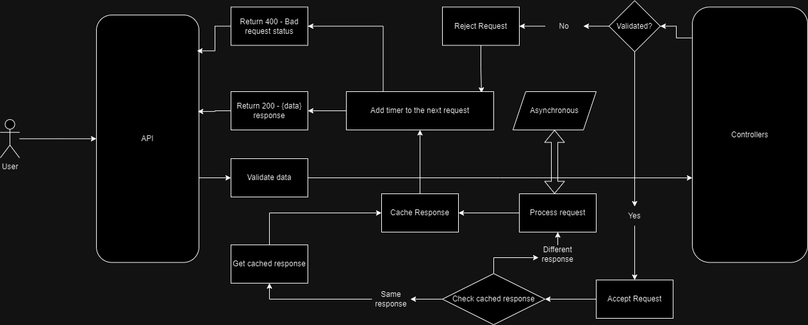

<p align="center">
  <a href="" rel="noopener">
 </a>
</p>
<h3 align="center">Toolbox</h3>

<div align="center">

[](https://toolbox.vercel.app)
[]()

</div>

---

<p align="center">
  This project will be an fullstack project with the goal to let it available to the public short functionalities that you'll need some day or you'll use in you day-to-day.
</p>

## 📝 Table of Contents

- [Problem Statement](#problem_statement)
- [Idea / Solution](#idea)
- [Future Scope](#future_scope)
- [Setting up a local environment](#getting_started)
- [Usage](#usage)
- [Technology Stack](#tech_stack)
- [Contributing](#contributing)
- [Authors](#authors)
- [Acknowledgments](#acknowledgments)

## 🧐 Problem Statement <a name = "problem_statement"></a>

When we need some short functions as document converting, password generation, or short some URL, we have to go and search for so many websites, this will generate a memory problem in your machine.

- IDEAL: It has to be a secure API with request limit for it, as it will be an open API, and it has to have intuitive documentation for another usage purposes for public developers.
- REALITY: Still in development

## 💡 Idea / Solution <a name = "idea"></a>

Unify all these functions to one simpel and intuitive website to all public with all ages.

This repository will be the backend of it.

It will one endpoint for each short functionality

## 🚀 Future Scope <a name = "future_scope"></a>

- [x] URL Shortener API endpoint
- [x] PDF converter API endpoint
- [ ] Password generator API endpoint

## 🏁 Getting Started <a name = "getting_started"></a>

Clone the project
```
git clone https://github.com/pedrohrbarros/toolbox
```

### Prerequisites

Install [Golang](https://go.dev/dl/)

### Installing

Install all dependecies

```
go get ./go.sum
```

## 🎈 Usage <a name="usage"></a>

Please follow the official [Swagger Documentation](https://toolbox.vercel.app/api/docs/)

## ⛏️ Built With <a name = "tech_stack"></a>

- [Golang](https://go.dev/) - Server Environment
- [Gin](https://gin-gonic.com/) - Server Framework
- [MongoDB](https://www.mongodb.com/) - Database

## ✍️ Authors <a name = "authors"></a>

- [@pedrohrbarros](https://github.com/pedrohrbarros) - Idea & Initial work

